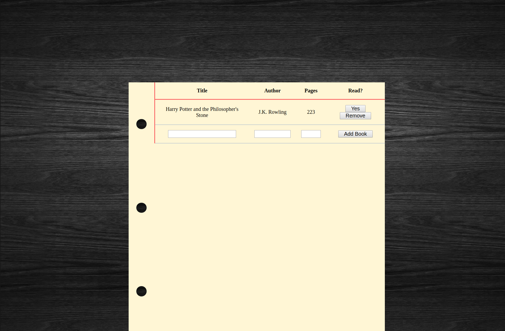

# Library Project

This project builds a simple library app where you can:
* Add/Remove Books
* Mark Books as Read/Unread
* Store data in LocalStorage.

This is a project from [The Odin Project](https://www.theodinproject.com/courses/javascript/lessons/library).

## Pre-Project Thoughts

No real thoughts going in.
Just learnt how JavaScript prototypes work.
A little wonky, but I get it.

## Post-Project Thoughts

LocalStorage is very nifty and easy to use.
There is no responsive design in this project.
